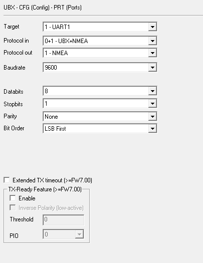
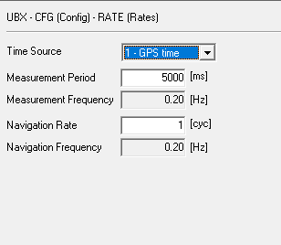

## Настройка GPS модуля UBLOX для работы в режиме геотаггера ##
1. CFG-MSG Отключить вывод NMEA сообщений в UART (можно оставить вывод в USB для отладочных целей):
    - F0-02 GxGSA (GNSS DOP and Active Satellites)
    - F0-03 GxGSV (GNSS Satellites in View)
2. CFG-MSG Убедиться, что включены NMEA сообщения (стоит галочка напротив UART):
    - F0-00 GxGGA (Global positioning system fix data)
    - F0-01 GxGLL (Latitude and longitude, with time of position fix and status)
    - F0-04 GxRMC (Recommended Minimum data)
    - F0-05 GxVTG (Course over ground and Ground speed)
    - F0-08 GxZDA (Time and Date) - опционально
3. CFG-PRT Сконфигурировать порты - см. скриншот
 
 
 
 
 
5. CFG-RATE Установить частоту замеров\записи данных - 5 сек. См. скриншот

 
 
 
7. CFG-CFG Сохранить в долговременной памяти
